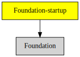

# Foundation-startup

#### ▶️  Startup code for the Foundation (mulle-objc)

This static library provides the required `__register_mulle_objc_universe`
function for executables, that link against
[Foundation](//github.com/MulleFoundation/Foundation).


| Release Version                                       | Release Notes  | AI Documentation
|-------------------------------------------------------|----------------|---------------
|  [](//github.com/MulleFoundation/Foundation-startup/actions) | [RELEASENOTES](RELEASENOTES.md) | [DeepWiki for Foundation-startup](https://deepwiki.com/MulleFoundation/Foundation-startup)


## Info

The main raison d'être of Foundation-startup as a
seperate library is to bequeath the required dependencies
[mulle-atinit](//github.com/mulle-core/mulle-atinit) and
[mulle-atexit](//github.com/mulle-core/mulle-atexit) for linking with the
executable.


## Requirements

|   Requirement         | Release Version  | Description
|-----------------------|------------------|---------------
| [Foundation](https://github.com/MulleFoundation/Foundation) |  [](https://github.com/MulleFoundation/Foundation/actions/workflows/mulle-sde-ci.yml) | 💍 MulleFoundation with improved compatibility and legacy support
| [mulle-atinit](https://github.com/mulle-core/mulle-atinit) |  [](https://github.com/mulle-core/mulle-atinit/actions/workflows/mulle-sde-ci.yml) | 🤱🏼 Compatibility library for deterministic initializers
| [mulle-atexit](https://github.com/mulle-core/mulle-atexit) |  [](https://github.com/mulle-core/mulle-atexit/actions/workflows/mulle-sde-ci.yml) | 👼 Compatibility library to fix atexit

### You are here



## Add

Use [mulle-sde](//github.com/mulle-sde) to add Foundation-startup to your project:

``` sh
mulle-sde add github:MulleFoundation/Foundation-startup
```

## Install

Use [mulle-sde](//github.com/mulle-sde) to build and install Foundation-startup and all dependencies:

``` sh
mulle-sde install --prefix /usr/local \
   https://github.com/MulleFoundation/Foundation-startup/archive/latest.tar.gz
```

### Legacy Installation

Install the requirements:

| Requirements                                 | Description
|----------------------------------------------|-----------------------
| [Foundation](https://github.com/MulleFoundation/Foundation)             | 💍 MulleFoundation with improved compatibility and legacy support
| [mulle-atinit](https://github.com/mulle-core/mulle-atinit)             | 🤱🏼 Compatibility library for deterministic initializers
| [mulle-atexit](https://github.com/mulle-core/mulle-atexit)             | 👼 Compatibility library to fix atexit

Download the latest [tar](https://github.com/MulleFoundation/Foundation-startup/archive/refs/tags/latest.tar.gz) or [zip](https://github.com/MulleFoundation/Foundation-startup/archive/refs/tags/latest.zip) archive and unpack it.

Install **Foundation-startup** into `/usr/local` with [cmake](https://cmake.org):

``` sh
cmake -B build \
      -DCMAKE_INSTALL_PREFIX=/usr/local \
      -DCMAKE_PREFIX_PATH=/usr/local \
      -DCMAKE_BUILD_TYPE=Release &&
cmake --build build --config Release &&
cmake --install build --config Release
```

## Author

[Nat!](https://mulle-kybernetik.com/weblog) for Mulle kybernetiK  


