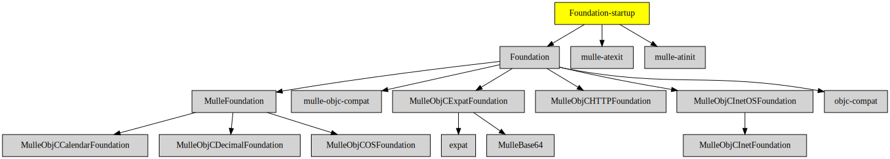

# Foundation-startup

#### ▶️ Startup library for MulleFoundation

This static library provides the required `__register_mulle_objc_universe`
function for executables, that link against
[Foundation](//github.com/MulleFoundation/Foundation).


## Sourcetree

The main raison d'être of Foundation-startup as a
seperate library is to bequeath the required dependencies
[mulle-atinit](//github.com/mulle-core/mulle-atinit) and
[mulle-atexit](//github.com/mulle-core/mulle-atexit) for linking with the
executable.


### You are here




## Install

See [foundation-developer](//github.com/MulleFoundation/foundation-developer) for
installation instructions.


## Build

### Manual Installation

*Don't do this, it will take hours...*

Install the requirements:

Requirements                                          | Description
------------------------------------------------------|-----------------------
[Foundation](//github.com/MulleFoundation/Foundation) | Foundation and its dependencies

Install into `/usr/local`:


``` sh
cmake -B build \
      -DCMAKE_INSTALL_PREFIX=/usr/local \
      -DCMAKE_PREFIX_PATH=/usr/local \
      -DCMAKE_BUILD_TYPE=Release &&
cmake --build build --config Release &&
cmake --install build --config Release
```


### Conveniently with mulle-sde

Install [mulle-sde](//github.com/mulle-sde) and run `mulle-sde craft`.


### Platforms and Compilers

All platforms and compilers supported by
[mulle-c11](//github.com/mulle-c/mulle-c11/) and
[mulle-thread](//github.com/mulle-concurrent/mulle-thread/).


## Author

[Nat!](//www.mulle-kybernetik.com/weblog) for
[Mulle kybernetiK](//www.mulle-kybernetik.com) and
[Codeon GmbH](//www.codeon.de)
